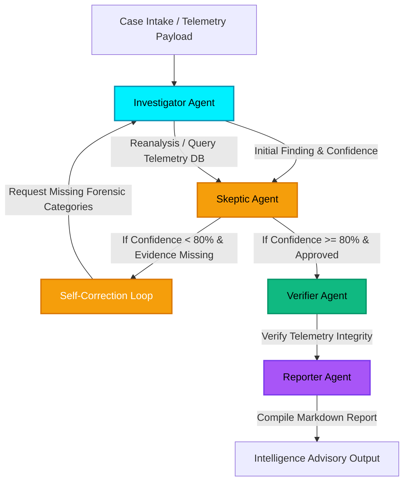

# 🛡️ SIFT Guardian: Self-Correcting Multi-Agent Incident Response

SIFT Guardian is an advanced, autonomous Security Operations Center (SecOps) incident response system designed to automate forensic investigation and intelligence advisory compilation. Built for **UC Berkeley's AI Hackathon**, SIFT Guardian solves the challenge of alert fatigue and rigid automation by utilizing a cognitive, self-correcting multi-agent architecture.

---

## 🌟 The Core Problem & Our Solution
Modern SOC analysts are overwhelmed by security alerts. Traditional Security Orchestration, Automation, and Response (SOAR) playbooks are fragile, brittle, and unable to deal with ambiguity. When telemetry is incomplete, a human must manually dig through logs.

**SIFT Guardian** changes this. By orchestrating a team of specialized AI agents in a **self-correcting cognitive loop**, the system can:
1. Conduct initial analysis on telemetry payloads.
2. Critique its own findings using a skeptic agent that flags gaps in forensic evidence.
3. Automatically route back for reanalysis to pull missing logs (e.g. parent processes, persistence mechanisms, or network connections).
4. Verify the finalized evidence tree.
5. Compile and export a professional, peer-reviewed **Intelligence Advisory Report**.

---

## 🗺️ System Topology & Agent Architecture

SIFT Guardian implements a directed cognitive pipeline with an active feedback loop:



### 🔍 Tactical Agents
*   **Investigator Agent:** Parses incoming payload data, detects threat classifications, and queries the enterprise telemetry database to retrieve detailed indicators of compromise (IoC).
*   **Skeptic Agent:** Acts as the Quality Assurance auditor. It challenges the initial analysis, checks for missing evidence categories (like Process Tree, Parent Process, Persistence, or Network Activity), and triggers the self-correction cycle if threshold standards are not met.
*   **Verifier Agent:** Inspects the gathered forensic evidence directly against the logging endpoints to approve credibility.
*   **Reporter Agent:** Formulates the peer-reviewed report into structured markdown, providing summaries, timeline flows, and actionable remediation steps.

---

## 🚀 Key Features

*   **Tactical Cyber-Defense Dashboard:** A beautiful command-center interface using a modern dark theme with custom scanline details.
*   **Dynamic Topology Map:** Live visual highlights illustrating which agent is active, including active loop indicators when the self-correction cycle is running.
*   **Real-time SecOps Terminal:** A simulated command-line output showing exact step-by-step logs and decision reasoning of each agent in color-coded lines.
*   **Advisory Export:** Quick button to export the finalized markdown file for local archival.
*   **Built-in Threat Profiles:** One-click loaders for common attack scenarios:
    *   *Suspicious PowerShell Execution* (Encoded command execution calling home).
    *   *Phishing Attachment Execution* (Word document spawning cmd and certutil).
    *   *IIS Web Shell Backdoor* (Web application process injecting ASPX shell).

---

## 💻 Tech Stack

*   **Backend:** ASP.NET Core Web API (.NET 10.0 C#)
*   **Frontend:** Vanilla HTML5, CSS3 (Tactical Grid & Glowing Glassmorphism), and JavaScript ES6.
*   **Design & Typography:** Space Grotesk (headers) & JetBrains Mono (monospaced logs).

---

## ⚙️ Project Setup & How to Run

### Prerequisites
*   [.NET 10.0 SDK](https://dotnet.microsoft.com/download/dotnet/10.0)

### 1. Clone & Build
```bash
# Navigate to the project directory
cd SIFTGuardian

# Build the project
dotnet build
```

### 2. Run the Server
```bash
# Start the web server with the HTTP profile
dotnet run --launch-profile "http"
```

The application will launch on:
*   **URL:** `http://localhost:5049`

### 3. Open in Browser
Open `http://localhost:5049` in your web browser, choose one of the Threat Profiles (e.g. *PowerShell Execution*), and click **Deploy Tactical Agents** to witness the self-correcting orchestration in real-time.
